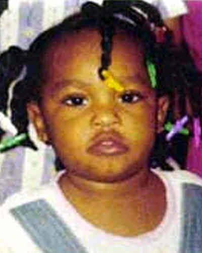

# Diamond Yvette Bradley

**Case ID:** BM-0004

## Overview

Diamond Yvette Bradley, age 3, disappeared on July 6, 2001 from Chicago, Illinois, United States. Diamond was last seen at her family's South Lake Park Avenue residence after her mother left for work around 6:30 a.m. She has not been seen since. The case is currently listed as Missing and is classified as Endangered Missing.

---

## Quick Facts

| Field | Value |
|-------|-------|
| Classification | Child |
| Case Status | Missing |
| Case Classification | Endangered Missing |
| Missing Date | July 6, 2001 |
| Age at Missing | 3 |
| Last Seen | Chicago, Illinois, United States |
| Investigative Status | Open / Unresolved — Missing-Person Investigation |
| Lead Agencies | Chicago Police Department and Federal Bureau of Investigation Chicago Office |

---

## Circumstances

Diamond was last seen at her family's residence in the 3500 block of South Lake Park Avenue in Chicago, Illinois on July 6, 2001. Her mother departed for work at approximately 6:30 a.m. The current case status is Missing, and the disappearance is classified as Endangered Missing. Diamond was last seen at her family's South Lake Park Avenue residence after her mother left for work around 6:30 a.m. She has not been seen since.

---

## Investigation

The case is currently recorded as Open / Unresolved — Missing-Person Investigation and is classified as Endangered Missing. The listed investigating agencies are Chicago Police Department and Federal Bureau of Investigation Chicago Office. Information and tips can be submitted to those agencies. The listed contact numbers are 312-745-6007 and 312-431-1333.

---

## Timeline

- **July 6, 2001** — Diamond was last seen at her family's South Lake Park Avenue residence after her mother left for work around 6:30 a.m. She has not been seen since.

---

## Physical Description

At the time of the disappearance, Diamond Yvette Bradley was 3 years old. This database lists the case in the Child category. The image shown above is the one used for this record. For height, weight, hair, eyes, clothing, and other identifying details, see the linked source profiles below.

---

## Related Cases

- [BM-0003](BM-0003.md) — Tionda Z. Bradley

---

## Notes

This case is currently listed as Missing and classified as Endangered Missing. Check the linked sources for the latest official information.

---

## Sources

### Primary Source

- [The Charley Project](https://charleyproject.org/case/diamond-yvette-bradley)

### Secondary Sources

- [Federal Bureau of Investigation](https://www.fbi.gov/wanted/kidnap/diamond-yvette-bradley)

---

## Last Updated

August 4, 2026
