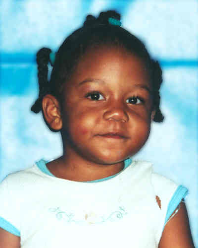

# Rilya Shenise Wilson

**Case ID:** BM-0008

## Case Summary

Rilya Shenise Wilson, age 4, disappeared on January 18, 2001 from Miami, Florida, United States. Rilya and her two siblings were removed from their mother's custody when Rilya was an infant. They were placed with Geralyn (alternatively spelled "Gerrilyn") Graham, their alleged grandmother or godmother, in Miami, Florida in 2000. The current case status is Missing, and the disappearance is classified as Suspected Homicide. Rilya had been placed with an alleged grandmother or godmother after being removed from her mother's custody. She later disappeared while in that woman's care, and the case is investigated as a suspected homicide.

---

## Quick Facts

| Field | Value |
|-------|-------|
| Classification | Child |
| Case Status | Missing |
| Case Classification | Suspected Homicide |
| Missing Date | January 18, 2001 |
| Age at Missing | 4 |
| Last Seen | Miami, Florida, United States |
| Investigative Status | Open / Unresolved — Suspected Homicide |
| Lead Agencies | Miami-Dade Police Department |

---

## Investigation

The case is currently recorded as Open / Unresolved — Suspected Homicide and is classified as Suspected Homicide. The listed investigating agency is Miami-Dade Police Department. Information and tips can be submitted to that agency. The listed contact number is 305-418-7302.

---

## Timeline

- **January 18, 2001** — Rilya had been placed with an alleged grandmother or godmother after being removed from her mother's custody.
- **Investigation Reclassified** — She later disappeared while in that woman's care, and the case is investigated as a suspected homicide.

---

## Physical Description

At the time of the disappearance, Rilya Shenise Wilson was 4 years old. This database lists the case in the Child category. The image shown above is the one used for this record. For height, weight, hair, eyes, clothing, and other identifying details, see the linked source profiles below.

---

## Notes

This case is currently listed as Missing and classified as Suspected Homicide. Check the linked sources for the latest official information.

---

## Sources

### Primary Source

- [The Charley Project](https://charleyproject.org/case/rilya-shenise-wilson)

### Secondary Sources

- [National Center for Missing & Exploited Children](https://www.missingkids.org/poster/ncmc/934322/1)

---

## Last Updated

August 8, 2026
