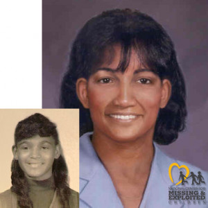

# Sherri Lee Truesdale

**Case ID:** BM-0067

## Case Summary

Sherri Lee Truesdale was 14 years old when the disappearance was reported on June 13, 1970. The recorded last-seen location is Winston-Salem, North Carolina, United States. Sherri took a bus downtown and never returned home. A lengthy search found no trace of her. The current case status is Missing. The disappearance is classified as Missing Under Mysterious Circumstances.

---

## Quick Facts

| Field | Value |
|-------|-------|
| Classification | Child |
| Case Status | Missing |
| Case Classification | Missing Under Mysterious Circumstances |
| Missing Date | June 13, 1970 |
| Age at Missing | 14 |
| Last Seen | Winston-Salem, North Carolina, United States |
| Investigative Status | Cold Case — Unresolved |
| Lead Agencies | Winston-Salem Police Department |

---

## Investigation

The case is currently recorded as Cold Case — Unresolved and is classified as Missing Under Mysterious Circumstances. The listed investigating agency is Winston-Salem Police Department. Information and tips can be submitted to that agency. The listed contact number is 336-773-7700.

---

## Timeline

- **June 13, 1970** — Sherri took a bus into downtown Winston-Salem and never returned home.
- **Search Conducted** — A lengthy search found no trace of her.

---

## Physical Description

At the time of the disappearance, Sherri Lee Truesdale was 14 years old. This database lists the case in the Child category. The image shown above is the one used for this record. For height, weight, hair, eyes, clothing, and other identifying details, see the linked source profiles below.

---

## Notes

This case is currently listed as Missing and classified as Missing Under Mysterious Circumstances. Check the linked sources for the latest official information.

---

## Sources

### Primary Source

- [Black and Missing Foundation](https://blackandmissinginc.com/missing-person-details?mp_id=7729)

### Secondary Sources

- [The Doe Network](https://www.doenetwork.org/cases/cases/75dfnc.html)

---

## Last Updated

August 8, 2026
