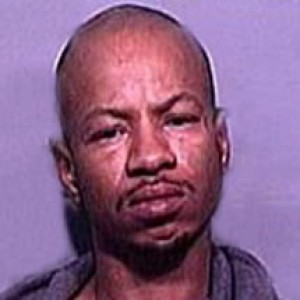

# Dion Tremayne Akemon

**Case ID:** BM-0088

## Case Summary

Dion Tremayne Akemon was 32 years old when the disappearance was reported on September 26, 2005. The recorded last-seen location is Cincinnati, OH, United States. Dion was last seen with his half-brother, William Roland, near a white van outside the Parktown Cafe in Cincinnati. William is also missing, and neither man has been found. The current case status is Missing. The disappearance is classified as Endangered Missing.

---

## Quick Facts

| Field | Value |
|-------|-------|
| Classification | Adult Man |
| Case Status | Missing |
| Case Classification | Endangered Missing |
| Missing Date | September 26, 2005 |
| Age at Missing | 32 |
| Last Seen | Cincinnati, OH, United States |
| Investigative Status | Open / Unresolved — Missing-Person Investigation |
| Lead Agencies | Cincinnati Police Department |

---

## Investigation

Cincinnati Police Department is the investigating agency listed in the current public case material. Anyone with information should contact the agency at 513-352-3542.

---

## Timeline

- **September 26, 2005** — Dion was last seen with his half brother, William Roland (also missing), at approximately 10:00pm. They were last seen around a white van in a parking lot near the Parktown Cafe near the 1700 block of Linn Street in Cincinnati, OH.

---

## Physical Description

At the time of the disappearance, Dion Tremayne Akemon was 32 years old. This database lists the case in the Adult Man category. The image shown above is the one used for this record. For height, weight, hair, eyes, clothing, and other identifying details, see the linked source profiles below.

---

## Notes

BAMFI profile and supporting source reviewed 2026-08-06; verify operational details with the investigating agency before use.

---

## Sources

### Primary Source

- [Black and Missing Foundation](https://www.blackandmissinginc.com/missing-person-details?mp_id=3265)

### Secondary Sources

- [Uncovered](https://uncovered.com/cases/dion-akemon)

---

## Last Updated

August 8, 2026
