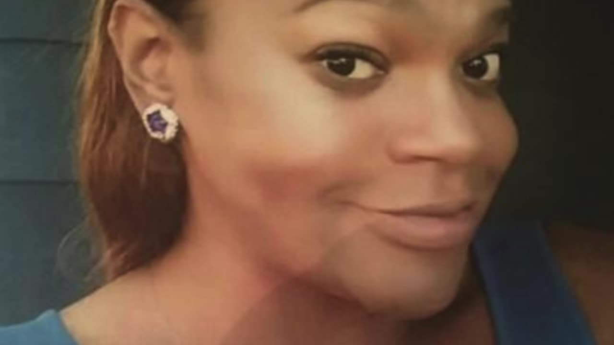

# Lovely (Angie) Brooks

**Case ID:** BM-0109

## Case Summary

Lovely (Angie) Brooks was 53 years old when the disappearance was reported on January 10, 2023. The recorded last-seen location is Richmond, VA, United States. Angie was last seen leaving her Richmond residence and left most of her belongings behind. Investigators have said foul play is possible, but she remains missing. The current case status is Missing. The disappearance is classified as Endangered Missing.

---

## Quick Facts

| Field | Value |
|-------|-------|
| Classification | LGBTQ+ |
| Case Status | Missing |
| Case Classification | Endangered Missing |
| Missing Date | January 10, 2023 |
| Age at Missing | 53 |
| Last Seen | Richmond, VA, United States |
| Investigative Status | Open / Unresolved — Missing-Person Investigation |
| Lead Agencies | Richmond Police Department |

---

## Investigation

Richmond Police Department is the investigating agency listed in current public case material. Tips may be provided at 804-646-5100.

---

## Timeline

- **January 10, 2023** — Angie was last seen leaving her residence in Richmond. She left most belongings behind, and investigators have said foul play is possible. Angie is a transgender woman.

---

## Physical Description

At the time of the disappearance, Lovely (Angie) Brooks was 53 years old. This database lists the case in the LGBTQ+ category. The image shown above is the one used for this record. For height, weight, hair, eyes, clothing, and other identifying details, see the linked source profiles below.

---

## Notes

LGBTQ+ classification is source-documented. Sources reviewed 2026-08-06; verify operational details with the investigating agency before use.

---

## Sources

### Primary Source

- [The Charley Project](https://charleyproject.org/case/lovely-andreya-brooks)

### Secondary Sources

- [Missingpeopleinamerica](https://missingpeopleinamerica.org/missing/lovely-angie-brooks)

---

## Last Updated

August 8, 2026
